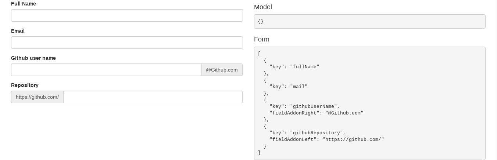

# Documentation

In this section, we describe all the features of the SF-Java-Ui. 

## Supported Fields
We start with the supported fields. Each field is rendered based on annotations and the different properties provided and filled by the developer, so in the section below we define the different properties supported by each field. 
For more details please visit [the Angular Schema Form documentation](https://github.com/json-schema-form/angular-schema-form/blob/master/docs/index.md#form-types)

### TextField:

To render a field as a TextField the developer must add the [@TextField](../src/main/java/io/asfjava/ui/core/form/TextField.java) annotation to his field. 

| Properties        | Type           | Usage |
| -------------     |:-------------: | :-----|
| title             | String         | The title of the field |
| placeHolder       | String         | Placeholder on inputs |
| description       | String         | A description, can be HTML |
| minLength         | Integer        | Min text length |
| maxLength         | Integer        | Max text length |
| pattern           | String (regEx) | Reg Ex used to validate the input |
| validationMessage | String         | A custom validation error message |
| readOnly          | Boolean        | Make the field readOnly |
| noTitle           | Boolean        | Set to true to hide title |
| fieldAddonLeft    | String         | [Extend form controls](http://getbootstrap.com/components/#input-groups) by adding text on the left side of the Text Field |
| fieldAddonRight   | String         | [Extend form controls](http://getbootstrap.com/components/#input-groups) by adding text on the right side of the Text Field |

The code below is an example using the TextField annotation. Feel free to try this code snipet:

```Java
import java.io.Serializable;

import io.asfjava.ui.core.form.TextField;

public class DemoForm implements Serializable {

	@TextField(title = "Full Name", minLenght = 3)
	private String fullName;

	@TextField(title = "Email", pattern = "^\\S+@\\S+$")
	private String mail;

	@TextField(title = "Repository", fieldAddonLeft = "https://github.com/")
	private String githubRepository;

	@TextField(title = "Github user name", fieldAddonRight = "@Github.com")
	private String githubUserName;

	public String getMail() {
		return mail;
	}

	public String getFullName() {
		return fullName;
	}

	public String getGithubRepository() {
		return githubRepository;
	}

	public String getGithubUserName() {
		return githubUserName;
	}
}

```


<center>*1- Demo TextField*</center>


### NumberField:

The given component can be used to fill numeric values, it can be applied to fields of type [java.lang.Number](https://docs.oracle.com/javase/7/docs/api/java/lang/Number.html) (Integer, Long, Double, Float, etc ...). The developer must use the [@Number](../src/main/java/io/asfjava/ui/core/form/Number.java) in this case.

| Properties        | Type           | Usage |
| -------------     |:-------------: | :-----|
| title             | String         | The title of the field |
| placeHolder       | String         | Placeholder on inputs |
| description       | String         | A description, can be HTML |
| validationMessage | String         | A custom validation error message |
| readOnly          | Boolean        | Make the field readOnly |
| noTitle           | Boolean        | Set to true to hide title |
| fieldAddonLeft    | String         | [Extend form controls](http://getbootstrap.com/components/#input-groups) by adding text on the left side of the Number Field |
| fieldAddonRight   | String         | [Extend form controls](http://getbootstrap.com/components/#input-groups) by adding text on the right side of the Number Field |

### PasswordField:

For some use cases, the developer need to use a encrypted UI input field to fill the user value. So he can use [@Password](../src/main/java/io/asfjava/ui/core/form/Password.java).

| Properties        | Type           | Usage |
| -------------     |:-------------: | :-----|
| title             | String         | The title of the field |
| placeHolder       | String         | Placeholder on inputs |
| description       | String         | A description, can be HTML |
| minLength         | Integer        | Min text length |
| maxLength         | Integer        | Max text length |
| pattern           | String (regEx) | Reg Ex used to validate the input |
| validationMessage | String         | A custom validation error message |
| readOnly          | Boolean        | Make the field readOnly |
| noTitle           | Boolean        | Set to true to hide title |
| fieldAddonLeft    | String         | [Extend form controls](http://getbootstrap.com/components/#input-groups) by adding text on the left side of the Password Field |
| fieldAddonRight   | String         | [Extend form controls](http://getbootstrap.com/components/#input-groups) by adding text on the right side of the Password Field |

### TextArea

The TextArea component is a multiline text field with a border and optional scroll bars. To use a this component the developer must use [@TextArea](../src/main/java/io/asfjava/ui/core/form/TextArea.java)

| Properties        | Type           | Usage |
| -------------     |:-------------: | :-----|
| title             | String         | The title of the field |
| placeHolder       | String         | Placeholder on inputs |
| description       | String         | A description, can be HTML |
| minLength         | Integer        | Min text length |
| maxLength         | Integer        | Max text length |
| validationMessage | String         | A custom validation error message |
| readOnly          | Boolean        | Make the field readOnly |
| noTitle           | Boolean        | Set to true to hide title |
| fieldAddonLeft    | String         | [Extend form controls](http://getbootstrap.com/components/#input-groups) by adding text on the left side of the Text Area |
| fieldAddonRight   | String         | [Extend form controls](http://getbootstrap.com/components/#input-groups) by adding text on the right side of the Text Area |
