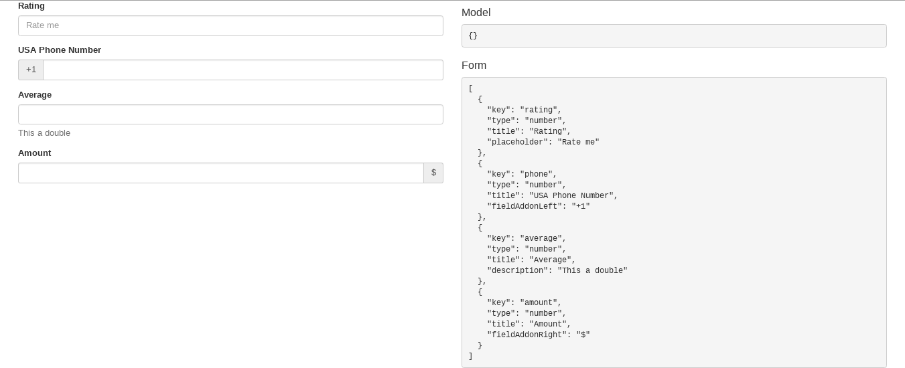
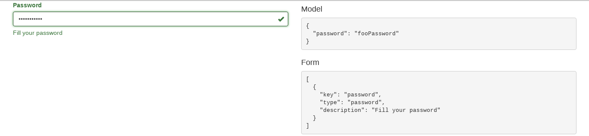
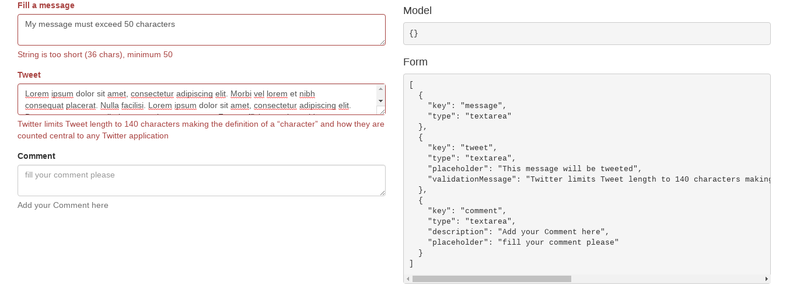
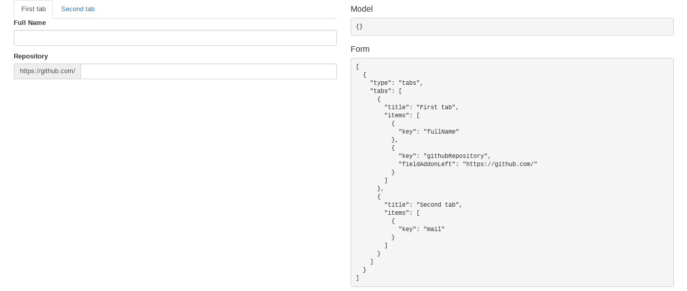
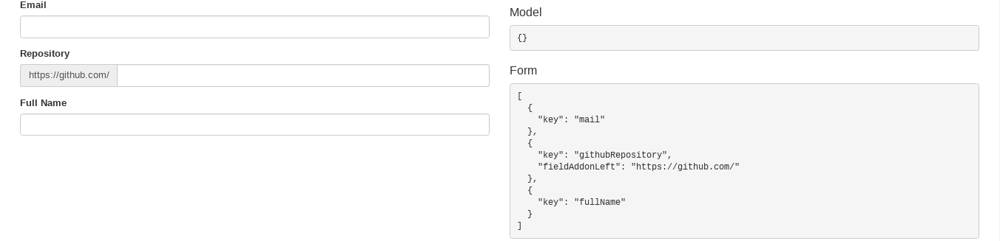
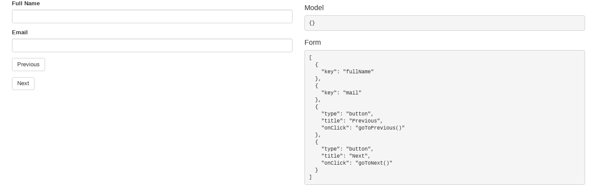
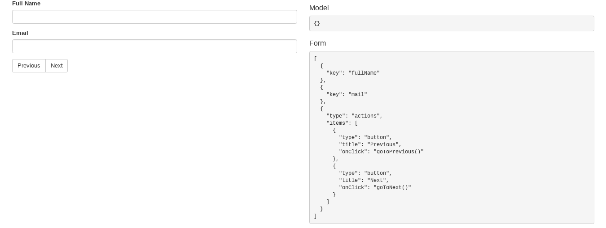

# Documentation

In this section, we describe all the features of the SF-Java-Ui. 

## Supported Fields
We start with the supported fields. Each field is rendered based on annotations and the different properties provided and filled by the developer, so in the section below we define the different properties supported by each field. 
For more details please visit [the Angular Schema Form documentation](https://github.com/json-schema-form/angular-schema-form/blob/master/docs/index.md#form-types)

### TextField:

To render a field as a TextField the developer must add the [@TextField](../src/main/java/io/asfjava/ui/core/form/TextField.java) annotation to his field. 

| Properties        | Type           | Usage |
| -------------     |:-------------: | :-----|
| title             | String         | The title of the field |
| placeHolder       | String         | Placeholder on inputs |
| description       | String         | A description, can be HTML |
| minLength         | Integer        | Min text length |
| maxLength         | Integer        | Max text length |
| pattern           | String (regEx) | Reg Ex used to validate the input |
| validationMessage | String         | A custom validation error message |
| readOnly          | Boolean        | Make the field readOnly |
| required          | Boolean        | Make the field required |
| noTitle           | Boolean        | Set to true to hide title |
| fieldAddonLeft    | String         | [Extend form controls](http://getbootstrap.com/components/#input-groups) by adding text on the left side of the Text Field |
| fieldAddonRight   | String         | [Extend form controls](http://getbootstrap.com/components/#input-groups) by adding text on the right side of the Text Field |

The code below is an example using the TextField annotation. Feel free to try this code snippet:

```Java
import java.io.Serializable;

import io.asfjava.ui.core.form.TextField;

public class DemoForm implements Serializable {

	@TextField(title = "Full Name", minLenght = 3)
	private String fullName;

	@TextField(title = "Email", pattern = "^\\S+@\\S+$")
	private String mail;

	@TextField(title = "Repository", fieldAddonLeft = "https://github.com/")
	private String githubRepository;

	@TextField(title = "Github user name", fieldAddonRight = "@Github.com")
	private String githubUserName;

	public String getMail() {
		return mail;
	}

	public String getFullName() {
		return fullName;
	}

	public String getGithubRepository() {
		return githubRepository;
	}

	public String getGithubUserName() {
		return githubUserName;
	}
}

```

1- Demo TextField


### NumberField:

The given component can be used to fill numeric values, it can be applied to fields of type [java.lang.Number](https://docs.oracle.com/javase/7/docs/api/java/lang/Number.html) (Integer, Long, Double, Float, etc ...). The developer must use the [@Number](../src/main/java/io/asfjava/ui/core/form/Number.java) in this case.

| Properties        | Type           | Usage |
| -------------     |:-------------: | :-----|
| title             | String         | The title of the field |
| placeHolder       | String         | Placeholder on inputs |
| description       | String         | A description, can be HTML |
| validationMessage | String         | A custom validation error message |
| readOnly          | Boolean        | Make the field readOnly |
| required          | Boolean        | Make the field required |
| noTitle           | Boolean        | Set to true to hide title |
| fieldAddonLeft    | String         | [Extend form controls](http://getbootstrap.com/components/#input-groups) by adding text on the left side of the Number Field |
| fieldAddonRight   | String         | [Extend form controls](http://getbootstrap.com/components/#input-groups) by adding text on the right side of the Number Field |

The code below is an example using the Number annotation. Feel free to try this code snippet:


```Java
import java.io.Serializable;

import io.asfjava.ui.core.form.Number;

public class DemoForm implements Serializable {

	@Number(title = "Average", description = "This a double")
	private Double average;

	@Number(title = "Rating", placeHolder = "Rate me")
	private short rating;

	@Number(title = "USA Phone Number", fieldAddonLeft = "+1")
	private Long phone;

	@Number(title = "Amount", fieldAddonRight = "$")
	private Double amount;

	public Double getAverage() {
		return average;
	}

	public short getRating() {
		return rating;
	}

	public Long getPhone() {
		return phone;
	}

	public Double getAmount() {
		return amount;
	}

}


```

2- Demo NumberField




### PasswordField:

For some use cases, the developer need to use a encrypted UI input field to fill the user value. So he can use [@Password](../src/main/java/io/asfjava/ui/core/form/Password.java).

| Properties        | Type           | Usage |
| -------------     |:-------------: | :-----|
| title             | String         | The title of the field |
| placeHolder       | String         | Placeholder on inputs |
| description       | String         | A description, can be HTML |
| minLength         | Integer        | Min text length |
| maxLength         | Integer        | Max text length |
| pattern           | String (regEx) | Reg Ex used to validate the input |
| validationMessage | String         | A custom validation error message |
| readOnly          | Boolean        | Make the field readOnly |
| required          | Boolean        | Make the field required |
| noTitle           | Boolean        | Set to true to hide title |
| fieldAddonLeft    | String         | [Extend form controls](http://getbootstrap.com/components/#input-groups) by adding text on the left side of the Password Field |
| fieldAddonRight   | String         | [Extend form controls](http://getbootstrap.com/components/#input-groups) by adding text on the right side of the Password Field |

The code below is an example using the Password annotation. Feel free to try this code snippet:

```Java

import java.io.Serializable;

import io.asfjava.ui.core.form.Password;

public class DemoForm implements Serializable {

	@Password(title = "Password", description = "Fill your password")
	private String password;

	public String getPassword() {
		return password;
	}

}

```

3- Demo PasswordField




### TextArea

The TextArea component is a multiline text field with a border and optional scroll bars. To use a this component the developer must use [@TextArea](../src/main/java/io/asfjava/ui/core/form/TextArea.java)

| Properties        | Type           | Usage |
| -------------     |:-------------: | :-----|
| title             | String         | The title of the field |
| placeHolder       | String         | Placeholder on inputs |
| description       | String         | A description, can be HTML |
| minLength         | Integer        | Min text length |
| maxLength         | Integer        | Max text length |
| validationMessage | String         | A custom validation error message |
| readOnly          | Boolean        | Make the field readOnly |
| required          | Boolean        | Make the field required |
| noTitle           | Boolean        | Set to true to hide title |
| fieldAddonLeft    | String         | [Extend form controls](http://getbootstrap.com/components/#input-groups) by adding text on the left side of the Text Area |
| fieldAddonRight   | String         | [Extend form controls](http://getbootstrap.com/components/#input-groups) by adding text on the right side of the Text Area |

The code below is an example using the TextArea annotation. Feel free to try this code snippet:

```Java

import java.io.Serializable;

import io.asfjava.ui.core.form.TextArea;

public class DemoForm implements Serializable {

	@TextArea(title = "Comment", description = "Add your Comment here", placeHolder = "fill your comment please")
	private String comment;

	@TextArea(title = "Tweet", placeHolder = "This message will be tweeted", maxLenght = 140, validationMessage = Messages.TWEET_VALIDATION)
	private String tweet;

	@TextArea(title = "Fill a message", minLenght = 50)
	private String message;

	public String getComment() {
		return comment;
	}

	public String getTweet() {
		return tweet;
	}

	public String getMessage() {
		return message;
	}

	private static final long serialVersionUID = -5073515619469444978L;
}

```

4- Demo TextArea



### Tabs

Tabs organize content into separate views where only one view can be visible at a time. To use a this component the developer must use [@Tab](../src/main/java/io/asfjava/ui/core/form/Tab.java). The idea is to allow the developer mark which component will be in a specific tab. The properties below must be filled by the developer to render the Tab.

| Properties        | Type           | Usage |
| -------------     |:-------------: | :-----|
| title             | String         | The title of the Tab |
| index             | Integer        | The tab index. In most case, there more than one tab in the screen |

The example below demonstrate how to use Tab annotation.

```Java

import java.io.Serializable;

import io.asfjava.ui.core.form.Tab;
import io.asfjava.ui.core.form.TextField;

public class DemoForm implements Serializable {

	@Tab(title = "First tab", index = 0)
	@TextField(title = "Full Name", minLenght = 3)
	private String fullName;

	@Tab(title = "Second tab", index = 1)
	@TextField(title = "Email", pattern = "^\\S+@\\S+$")
	private String mail;

	@Tab(title = "First tab", index = 0)
	@TextField(title = "Repository", fieldAddonLeft = "https://github.com/")
	private String githubRepository;

	public String getMail() {
		return mail;
	}

	public String getFullName() {
		return fullName;
	}

	public String getGithubRepository() {
		return githubRepository;
	}

}

```

5- Demo Tab



### Index

Having the ability to handle the fields order in the screen is very important for developers, this is why we added an [@Index](../src/main/java/io/asfjava/ui/core/form/Index.java) annotation that allow you to mark the index of your field in the rendered screen.

N.B: The [@Index](../src/main/java/io/asfjava/ui/core/form/Index.java) annotation also used with [@Tab](../src/main/java/io/asfjava/ui/core/form/Tab.java) annotation. It handle the order of components into the tab rendered

| Properties        | Type           | Usage |
| -------------     |:-------------: | :-----|
| value             | Integer        | The value of the index |

The example below demonstrate how to use Index annotation.

```Java

import java.io.Serializable;

import io.asfjava.ui.core.form.Index;
import io.asfjava.ui.core.form.TextField;

public class DemoForm implements Serializable {

	@Index(3)
	@TextField(title = "Full Name")
	private String fullName;

	@Index(1)
	@TextField(title = "Email", pattern = "^\\S+@\\S+$")
	private String mail;

	@Index(2)
	@TextField(title = "Repository", fieldAddonLeft = "https://github.com/")
	private String githubRepository;

	public String getMail() {
		return mail;
	}

	public String getFullName() {
		return fullName;
	}

	public String getGithubRepository() {
		return githubRepository;
	}

}

```

6- Demo Index



### Action

Actions are crucial in form screens. To add an action to your form, you have to use the [@Action](../src/main/java/io/asfjava/ui/core/form/Action.java) annotation.

| Properties        | Type           | Usage |
| -------------     |:-------------: | :-----|
| type              | String         | The action type |
| title             | String         | The action title |
| onClick           | String         | The client side function to fire when clicking on the tab |

The example below demonstrate how to use Action annotation.

```Java

import java.io.Serializable;

import io.asfjava.ui.core.form.Action;
import io.asfjava.ui.core.form.TextField;

@Action(title = "Previous", type = "button", onClick = "goToPrevious()")
@Action(title = "Next", type = "button", onClick = "goToNext()")
public class DemoForm implements Serializable {

	@TextField(title = "Full Name")
	private String fullName;

	@TextField(title = "Email", pattern = "^\\S+@\\S+$")
	private String mail;

	public String getMail() {
		return mail;
	}

	public String getFullName() {
		return fullName;
	}

}


```

6- Demo Action



### ActionGroup

Developer have the ability to group Actions. To add a group of actions to your form, you have to use the [@ActionsGroup](../src/main/java/io/asfjava/ui/core/form/ActionsGroup.java) annotation.

| Properties        | Type           | Usage |
| -------------     |:-------------: | :-----|
| value             | Array of [@Action](../src/main/java/io/asfjava/ui/core/form/Action.java)| Array of actions |

The example below demonstrate how to use ActionsGroup annotation.

```Java

import java.io.Serializable;

import io.asfjava.ui.core.form.Action;
import io.asfjava.ui.core.form.ActionsGroup;
import io.asfjava.ui.core.form.TextField;

@ActionsGroup({ 
		@Action(title = "Previous", type = "button", onClick = "goToPrevious()"),
		@Action(title = "Next", type = "button", onClick = "goToNext()") 
})
public class DemoForm implements Serializable {

	@TextField(title = "Full Name")
	private String fullName;

	@TextField(title = "Email", pattern = "^\\S+@\\S+$")
	private String mail;

	public String getMail() {
		return mail;
	}

	public String getFullName() {
		return fullName;
	}

}


```

6- Demo ActionGroup

